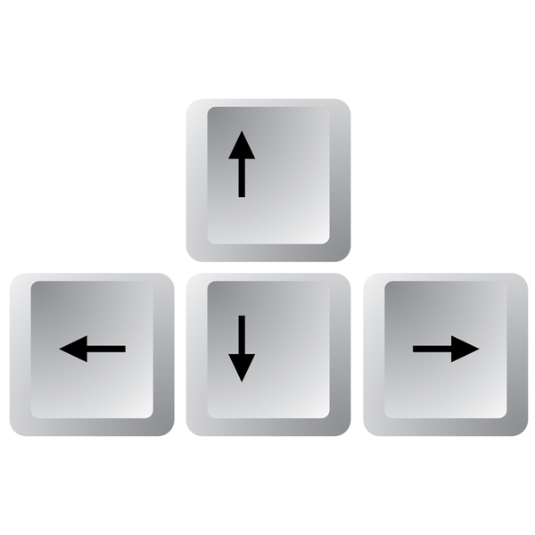

# Arcade Game

## Table of Contents

* [Project](#project)
* [Launching](#launching)
* [Game](#game)
* [Instructions](#instructions)
* [License](#license)

## Project

The Arcade Game Project is a part of the Front-End Web Developer Nanodegree Program.

## Launching

Open index.html file in a browser to launch the game.

## Game 

### Board

The board contains of three type of surface: grass, road and water.

Grass

Road

Water

The enemies can move only on the road. The player can move anywhere on the board.

### Characters

The main character is a Player.

There are Enemies on the board. Each enemy moves on the road from left to right at different speed.

### Controls

Move the Player using UP, DOWN, LEFT and RIGHT keys.

## Instructions

1. The player must reach the top of the board,

2. The player may move anywhere on the board by pressing the up, down, left, or right buttons on the keyboard.

3. The player must avoid the enemies. If the player hits an enemy, the player will be sent back down.

4. If the player reaches the top, the player wins. The player will send back down to try again.

## License

The content of this repository is licensed under a
[Creative Commons Attribution License](http://creativecommons.org/licenses/by/3.0/us/)
